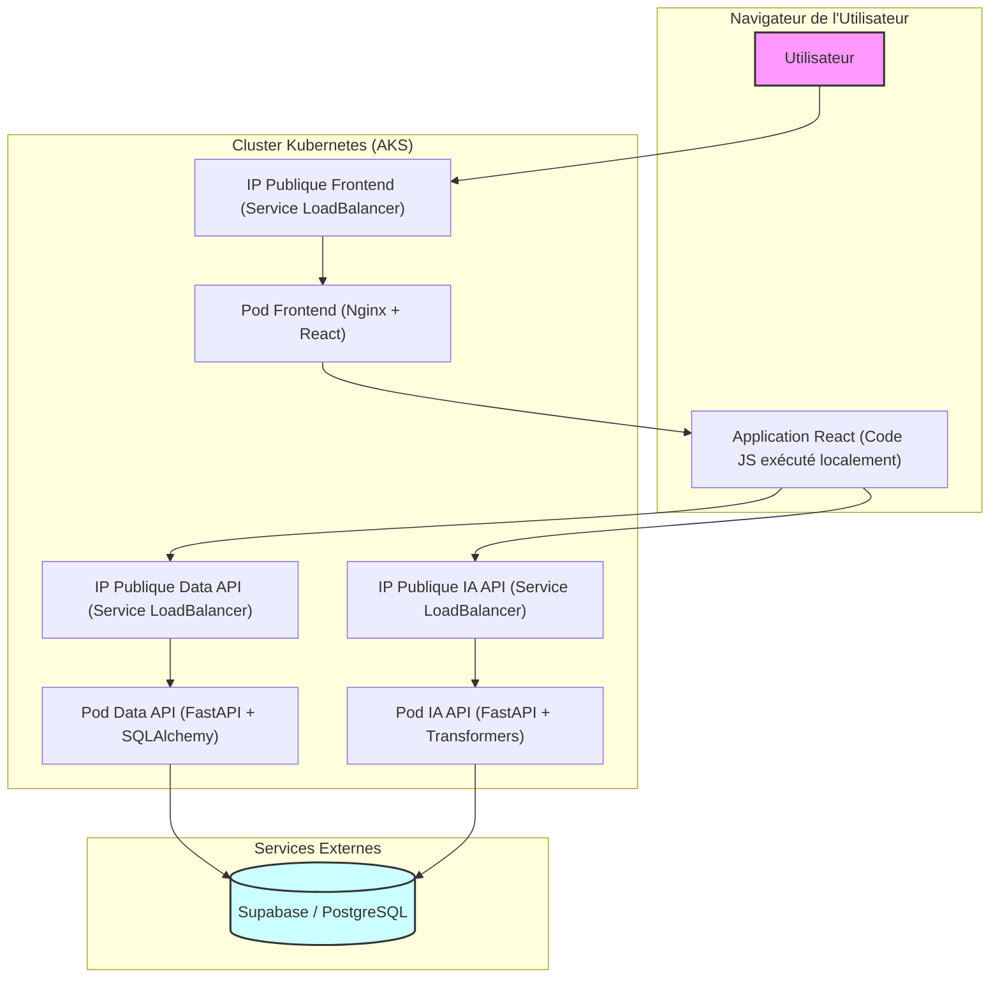

# Architecture Technique - Frontend de Traduction

Ce document détaille l'architecture et les choix techniques retenus pour le développement de l'application frontend. Il constitue la réponse technique aux besoins fonctionnels et aux parcours utilisateurs qui sont formalisés dans le document de spécifications fonctionnelles.

➡️ **Consulter les spécifications fonctionnelles : [SPECIFICATIONS_FRONTEND.md](./SPECIFICATIONS_FRONTEND.md)**

---

## 1. Choix des Technologies et Outils

Le développement de l'application s'appuiera sur un écosystème JavaScript moderne, axé sur la performance, la maintenabilité et une expérience de développement fluide.

| Catégorie | Outil / Technologie | Justification |
| --------- | ------------------- | ------------- |
|           |                     |               |

| **Framework UI**     | React (avec Vite) | Un standard de l'industrie pour construire des interfaces utilisateur réactives et modulaires. Vite offre un environnement de développement ultra-rapide et une configuration optimisée par défaut (SPA sans rechargement). |
| -------------------- | ----------------- | --------------------------------------------------------------------------------------------------------------------------------------------------------------------------------------------------------------------------- |
| **Langage**          | JavaScript (ES6+) | Le langage natif du navigateur, indispensable pour une application frontend interactive.                                                                                                                                    |
| **Client HTTP**      | Axios             | Une bibliothèque robuste pour effectuer les requêtes HTTP vers nos API backend. Elle gère nativement les promesses et simplifie l'interception des requêtes/réponses (ajout du token JWT).                                  |
| **Gestion Paquets**  | NPM               | Le gestionnaire de paquets par défaut de l'écosystème Node.js.                                                                                                                                                              |
| **Conteneurisation** | Docker            | Permet de packager notre application frontend dans une image portable, garantissant un environnement d'exécution cohérent du développement à la production.                                                                 |
| **Serveur Web**      | Nginx             | Un serveur web haute performance et léger, parfait pour servir les fichiers statiques (HTML, CSS, JS) de notre application React une fois "buildée".                                                                        |
| **Versionnement**    | Git & GitHub      | Pour le suivi du code source, la collaboration et l'intégration avec les workflows CI/CD.                                                                                                                                   |

### Justification des choix par rapport à d'autres alternatives

- **Pourquoi pas Django ?**\
  Django est un framework backend "full-stack" puissant, écrit en Python. Ici, les backends existent déjà sous forme d'API FastAPI. Utiliser Django pour le frontend serait redondant et contraire au principe de séparation des préoccupations. React est conçu pour un client découplé.

- **Pourquoi pas Streamlit ou Gradio ?**\
  Ces outils sont excellents pour des démos rapides mais offrent moins de contrôle sur l'UI/UX et sont moins adaptés pour construire un client web indépendant et optimisé pour la production, respectant des spécifications précises (notamment d'accessibilité).

**En conclusion**, la stack React + Nginx est la plus adaptée pour construire un client web découplé, personnalisable et optimisé pour la production, qui consomme des API existantes.

---

## 2. Architecture Applicative et Flux de Données

### 2.1. Schéma d'Architecture sur Kubernetes (Mis à jour)

L'application est conçue selon une architecture N-tiers. Le frontend est totalement découplé des services backend et communique avec eux via leurs adresses IP publiques respectives, gérées par des services LoadBalancer sur Kubernetes.

#### Description du schéma

- **Utilisateur Final :** L'utilisateur accède à l'application via son navigateur.
- **Azure Load Balancer (Frontend) :** Le trafic est dirigé vers le pod Nginx du frontend.
- **Pod Frontend (React + Nginx) :** Le conteneur Nginx sert les fichiers statiques (HTML, CSS, JS) de l'application React.
- **Communication Frontend → Backend APIs :**
  - Pour l'inscription (`/register`) et la connexion (`/login`), le frontend appelle l'API de Données (data-api).
  - Pour la traduction (`/generer`), il appelle l'API d'IA (ia-api).
- **Load Balancers des API :** Chaque API a son propre service LoadBalancer qui reçoit les requêtes et les transmet au pod correspondant.
- **Pods Backend :**
  - Le pod `data-api` gère la logique de création et d'authentification des utilisateurs.
  - Le pod `ia-api` gère la logique d'inférence du modèle de traduction.
- **Base de Données (Supabase) :** Les deux API interagissent avec la base de données PostgreSQL pour les tâches liées aux utilisateurs (création, vérification des identifiants).

---

### 2.2. Flux de Données d'Authentification (JWT)

La sécurité est assurée par des **JSON Web Tokens (JWT)**.

1. **Login :** L'utilisateur soumet ses identifiants au `POST /login` de la data-api.
2. **Validation :** L'API vérifie les identifiants dans la base de données.
3. **Génération du Token :** Si valides, l'API génère un token JWT signé.
4. **Stockage du Token :** Le frontend reçoit et stocke le token de manière sécurisée (ex : `sessionStorage`).
5. **Requêtes Authentifiées :** Pour les requêtes protégées (comme `POST /generer` sur l'ia-api), le frontend ajoute l'en-tête `Authorization: Bearer <token>`.
6. **Vérification du Token :** L'ia-api reçoit la requête, décode le token, et vérifie sa validité avant d'autoriser l'accès.

---

### 2.3. Flux de Données d'Inscription (Nouveau)

Le processus de création de compte suit ce flux :

1. **Saisie :** L'utilisateur remplit le formulaire d'inscription sur le frontend (nom d'utilisateur, mot de passe).
2. **Requête de Création :** Le frontend envoie une requête `POST /register` à l'API de Données (data-api) avec les informations saisies.
3. **Traitement Backend :**
   - L'API de Données reçoit la requête.
   - Vérifie si le nom d'utilisateur n'est pas déjà pris.
   - Hache le mot de passe en utilisant `bcrypt`.
   - Insère le nouvel utilisateur dans la base de données.
4. **Réponse de l'API :**
   - **Succès (**``**) :** L'API renvoie les informations de l'utilisateur créé (sans le mot de passe).
   - **Échec (**``**) :** Si l'utilisateur existe déjà, l'API renvoie une erreur.
5. **Traitement Frontend :**
   - En cas de succès : le frontend affiche un message de confirmation et redirige l'utilisateur vers la page de connexion.
   - En cas d'échec : le frontend affiche un message d'erreur clair à l'utilisateur (ex : "Ce nom d'utilisateur est déjà utilisé.").

---

### 2.4. Considérations sur l'Éco-Conception et la Démarche Éco-Responsable

Bien que le projet n'ait pas eu l'éco-responsabilité comme contrainte principale, les choix techniques ont été faits en faveur de l'efficacité, de la performance et de la maîtrise des ressources, ce qui est directement aligné avec les principes du *Green IT* et de la sobriété numérique.

Les points suivants démontrent comment une démarche éco-responsable a été favorisée :

1.  **Choix d'un Hébergeur Cloud Engagé (PaaS - Azure) :**
    *   Le déploiement sur Microsoft Azure s'appuie sur un fournisseur qui a des objectifs clairs de neutralité carbone et d'alimentation de ses datacenters par des énergies renouvelables. L'utilisation de services managés comme **Azure Kubernetes Service (AKS)** permet de mutualiser les infrastructures physiques, optimisant ainsi l'efficacité énergétique (PUE - *Power Usage Effectiveness*) par rapport à un hébergement sur site.

2.  **Utilisation de Conteneurs Légers (Docker) :**
    *   La conteneurisation avec Docker, et particulièrement l'usage d'images de base `python:3.11-slim` (`api/ia_api/Dockerfile`), permet de créer des artefacts légers. Des images plus petites signifient moins de données à stocker, à transférer sur le réseau et des temps de démarrage plus rapides, réduisant ainsi la consommation de ressources à chaque déploiement.

En conclusion, en privilégiant des services cloud modernes, des technologies légères et performantes,  le projet favorise une approche technique sobre et efficace, alignée avec une démarche éco-responsable.

---

