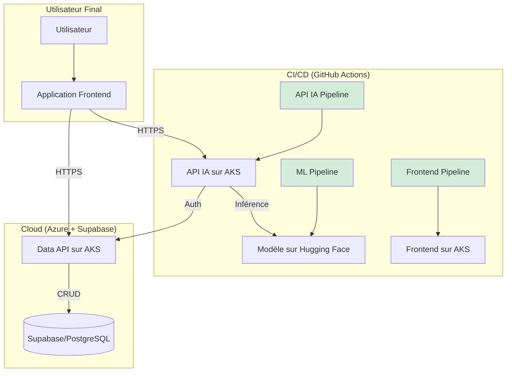

# Traducteur Darija : Application Complète avec MLOps

Ce projet est une application web complète de traduction Français/Anglais ↔ Darija Marocain. Il couvre l'intégralité du cycle de vie du produit, depuis la collecte et la préparation des données jusqu'au fine-tuning d'un modèle de LLM, son déploiement via une API monitorée, et sa consommation par une interface utilisateur moderne.

L'ensemble de l'écosystème est automatisé via des pipelines CI/CD robustes, illustrant une approche MLOps de bout en bout.

## ✨ Fonctionnalités Clés

* **Application Frontend (React)** : Une interface utilisateur réactive pour l'inscription, l'authentification et la traduction en temps réel.
* **API d'Inférence (FastAPI)** : Un service léger et performant qui expose le modèle de traduction via un endpoint sécurisé.
* **API de Données (FastAPI)** : Un service CRUD pour gérer le corpus de traduction et l'authentification des utilisateurs.
* **Pipeline de Données** : Scripts automatisés pour la collecte de données (scraping, API), le nettoyage (PySpark) et la normalisation.
* **Pipeline MLOps** : Fine-tuning d'un modèle NLLB avec **LoRA**, suivi des expériences avec **MLflow**, et déploiement conditionnel sur **Hugging Face Hub**.
* **Monitoring & Alerting** : Une stack complète **Prometheus + Grafana + Alertmanager** pour surveiller la performance de l'API IA, la fiabilité et le *data drift*.
* **Infrastructure sur Azure** : Déploiement conteneurisé sur **Azure Kubernetes Service (AKS)**, avec gestion des images sur **Azure Container Registry (ACR)**.
* **CI/CD (GitHub Actions)** : Trois pipelines d'automatisation distincts pour le Frontend, l'API IA, et le modèle ML, garantissant la qualité et la livraison continue.

## 🏛️ Architecture Globale

Le projet est divisé en modules indépendants mais interconnectés, chacun ayant un rôle précis :



Le Pipeline MLOps entraîne, valide et déploie le modèle de traduction sur Hugging Face Hub.  
L'Application Frontend (React) est l'interface client. Elle communique avec les deux APIs backend.  
L'API IA (FastAPI) reçoit les demandes de traduction du frontend, les authentifie auprès de la Data API, et appelle le modèle sur Hugging Face pour effectuer l'inférence.  
L'API de Données (FastAPI) gère la base de données PostgreSQL (hébergée sur Supabase) pour l'authentification et le stockage du corpus.  
Les Pipelines CI/CD automatisent les tests, le build des images Docker et le déploiement de l'API IA et du Frontend sur Azure Kubernetes Service (AKS).  

## 📂 Structure du Projet

| Dossier | Description | Documentation Détaillée |
| :--- | :--- | :--- |
| `.github/workflows/` | Contient les 3 pipelines CI/CD (Frontend, API IA, Modèle ML). | Guide CI/CD |
| `api/` | Contient le code des deux backends FastAPI. | |
| `api/data_api/` | Gère les données du corpus et l'authentification des utilisateurs. | README |
| `api/ia_api/` | Expose le modèle d'IA et intègre la stack de monitoring. | README |
| `data/` | Pipeline complet d'acquisition et de nettoyage des données brutes. | README |
| `database/` | Gère le schéma, les migrations, et la maintenance de la base de données PostgreSQL. | README |
| `docs/` | Documentation technique et de conformité du projet. | |
| `frontend/` | Application React (Vite) constituant l'interface utilisateur. | README |
| `k8s/` | Manifestes Kubernetes pour le déploiement sur AKS. | |
| `llm/` | Pipeline MLOps pour le fine-tuning, l'évaluation et la gestion du modèle. | README |
| `tests/` | Tests unitaires et d'intégration pour les différents modules. | |

## 🚀 Démarrage Rapide (Développement Local)

### Prérequis
- Docker & Docker Compose  
- Node.js v18+ et npm  
- Python 3.11+ et pip  
- Azure CLI (`az`), `kubectl` (pour le déploiement)  
- Un compte Supabase, Hugging Face et Azure.

### 1. Configuration Initiale
Clonez le dépôt :
```bash
git clone <URL_DU_PROJET>
cd darija_app_final
```

Configurez l'environnement :
```bash
cp .env.example .env
nano .env
```

Installez les dépendances :
```bash
# Dépendances Python (pour les APIs et le LLM)
pip install -r requirements.txt

# Dépendances JavaScript (pour le Frontend)
cd frontend && npm install && cd ..
```

### 2. Lancer la Base de Données
Si vous travaillez en local, mettez en place la base de données PostgreSQL :
```bash
bash database/install_postgresql.sh
```
Suivez les invites interactives à la fin du script.

### 3. Lancer les Services
Lancer l'IA API et sa stack de monitoring :
```bash
cd api/ia_api/
docker-compose up --build
```
- API IA disponible sur [http://localhost:8001](http://localhost:8001)  
- Grafana sur [http://localhost:3000](http://localhost:3000)  

Lancer la Data API :
```bash
uvicorn api.data_api.main:app --host 0.0.0.0 --port 8000 --reload
```

Lancer le Frontend :
```bash
cd frontend/
npm run dev
```
Application disponible sur [http://localhost:5173](http://localhost:5173)

## ☁️ Déploiement sur Azure

Le déploiement en production est entièrement géré par les pipelines CI/CD de GitHub Actions.  
Un push sur la branche `main` déclenchera automatiquement les tests, le build des images et le déploiement sur AKS.  

Pour plus de détails sur le fonctionnement des pipelines, consultez le **Guide CI/CD & MLOps**.
