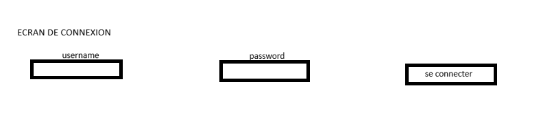
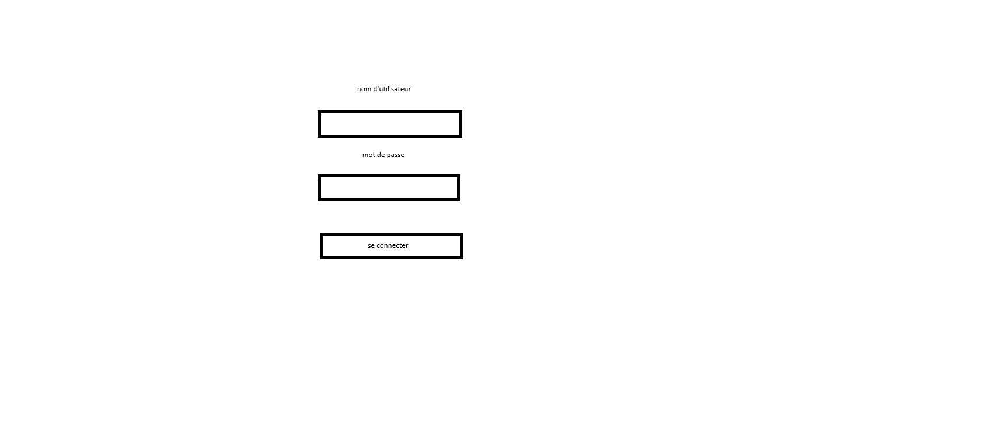
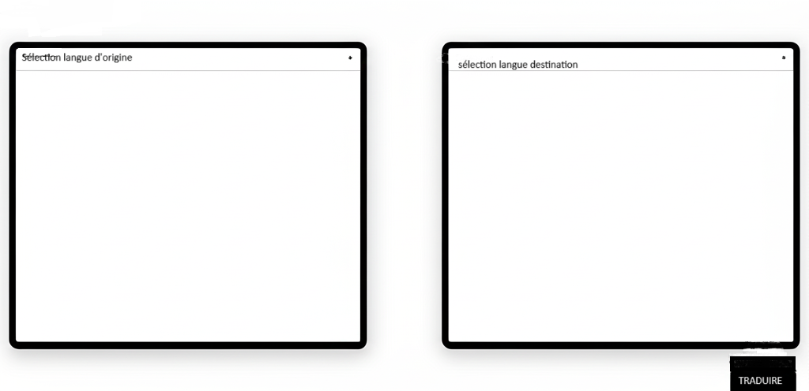

# Spécifications Fonctionnelles et Techniques - Frontend de Traduction

## 1. Contexte et Objectifs

- **Commanditaire :** Le développeur du projet (dans le cadre de la certification).
- **Besoin :**  
  L'API de traduction multilingue (Français/Anglais ↔ Darija) est déployée et fonctionnelle. Actuellement, elle peut être testée via sa documentation interactive (Swagger UI), mais cela reste une interface destinée aux développeurs. Pour la rendre accessible à un utilisateur final et en démontrer la valeur, il est nécessaire de développer une application web (frontend) simple et intuitive.

- **Objectif du projet :**  
  Concevoir, développer et déployer une application web qui consomme les API existantes (`api_ia` et `api_data`). L'application doit permettre à un utilisateur de créer un compte, de s'authentifier, de choisir les langues source et cible, de soumettre un texte à traduire, et de visualiser le résultat.

---

## 2. Spécifications Fonctionnelles (User Stories)

Chaque spécification fonctionnelle couvre le contexte, les scénarios d’utilisation et les critères de validation.

### US-1 : Authentification de l'utilisateur (Mis à jour)

**En tant que** visiteur,  
**Je veux** pouvoir me connecter avec un nom d'utilisateur et un mot de passe,  
**Afin de** sécuriser l'accès à la fonctionnalité de traduction.

**Critères d'acceptation :**
- Un formulaire de connexion est présent avec des champs "Nom d'utilisateur" et "Mot de passe".
- Si les identifiants sont corrects (validés par l'endpoint `POST /login` de l'API), l'utilisateur est redirigé vers la page de traduction.
- Si les identifiants sont incorrects, un message d'erreur clair est affiché.
- (Nouveau) Le formulaire de connexion inclut un lien bien visible "Vous n'avez pas de compte ? S'inscrire" qui redirige vers la page d'inscription.
- (**Accessibilité O1, O4**) Les champs du formulaire, le bouton et le lien sont accessibles et activables au clavier. Chaque champ de saisie est associé à une balise `<label>`.

---

### US-2 : Traduction de texte

**En tant qu'** utilisateur authentifié,  
**Je veux** pouvoir saisir un texte, sélectionner une langue source (Français, Anglais, Darija) et une langue cible, puis lancer la traduction,  
**Afin d'** obtenir la version traduite de mon texte.

**Critères d'acceptation :**
- L'interface affiche deux zones de texte : une pour l'entrée, une pour le résultat.
- Des menus déroulants permettent de choisir la langue source et la langue cible parmi les options supportées (`fra_Latn`, `eng_Latn`, `ary_Arab`).
- Un bouton "Traduire" est présent.
- Après un clic sur "Traduire", le texte traduit par l'API (`api_ia`) s'affiche dans la zone de résultat.
- Pendant le traitement, un indicateur de chargement est visible.
- En cas d'erreur de l'API (ex : texte trop long), un message d'erreur est affiché.
- (**Accessibilité O1, O2, O3**) Tous les contrôles (menus, bouton) sont utilisables au clavier. Le texte des messages d'erreur respecte les ratios de contraste. L'indicateur de chargement est associé à un texte alternatif pour les lecteurs d'écran.

---

### US-3 : Création d'un nouveau compte (Nouveau)

**En tant que** nouveau visiteur,  
**Je veux** pouvoir créer un compte en fournissant un nom d'utilisateur et un mot de passe,  
**Afin de** pouvoir utiliser le service de traduction.

**Critères d'acceptation :**
- Une page d'inscription est accessible depuis la page de connexion.
- Le formulaire d'inscription contient les champs : "Nom d'utilisateur", "Mot de passe" et "Confirmer le mot de passe".
- La validation côté client vérifie que les deux mots de passe saisis sont identiques.
- La soumission du formulaire envoie les données à l'endpoint `POST /register` de la `data_api`.
- En cas de succès : l'utilisateur est redirigé vers la page de connexion avec un message de succès (ex : "Votre compte a été créé avec succès. Vous pouvez maintenant vous connecter.").
- En cas d'échec (ex : l'API renvoie une erreur 409 car le nom d'utilisateur existe déjà) : Un message d'erreur clair est affiché à l'utilisateur (ex : "Ce nom d'utilisateur est déjà pris.").
- (**Accessibilité O1, O2, O4**) Les champs du formulaire sont correctement étiquetés, accessibles au clavier et les messages d'erreur respectent les contrastes de couleurs.

---

## 3. Modélisation des Interfaces (Wireframes)

Les wireframes ci-dessous présentent une vue simplifiée des écrans principaux de l'application.

### Écran de Connexion 

> Parcours : L'utilisateur arrive sur cet écran, saisit ses identifiants et clique sur "Se connecter". S'il n'a pas de compte, il peut cliquer sur le lien pour s'inscrire.  
> Modification : Ajout d'un lien "Créer un compte" en bas du formulaire, qui redirige vers le nouvel écran d'inscription.

---

### Écran d'Inscription 

> Parcours : L'utilisateur accède à cet écran depuis la page de connexion. Il remplit les champs requis. Après une création réussie, il est renvoyé à la page de connexion pour s'identifier.

**Composants :**
- Titre : "Créer un compte"
- Champ de saisie : "Nom d'utilisateur"
- Champ de saisie (type password) : "Mot de passe"
- Champ de saisie (type password) : "Confirmer le mot de passe"
- Bouton : "Créer le compte"
- Lien de retour : "Déjà un compte ? Se connecter"

---

### Écran de Traduction

> Parcours : Après une connexion réussie, l'utilisateur accède à cet écran. Il peut sélectionner les langues, saisir son texte, et obtenir la traduction.

---

## 4. Objectifs d'Accessibilité

L'application vise un niveau de conformité **WCAG 2.1 Niveau AA**.  
Les objectifs prioritaires sont :

- **O1 - Navigabilité au clavier :**  
  Toutes les fonctionnalités (champs de formulaire, boutons, listes déroulantes) doivent être accessibles et utilisables uniquement avec la touche Tab et Entrée, sans nécessiter de souris.

- **O2 - Contraste des couleurs :**  
  Le texte et les éléments interactifs doivent avoir un rapport de contraste d'au moins 4.5:1 par rapport à leur arrière-plan.

- **O3 - Alternatives textuelles :**  
  Les éléments non textuels (comme les icônes de chargement) doivent avoir une alternative textuelle (par exemple, via un attribut `aria-label`).

- **O4 - Structure sémantique :**  
  Le code HTML utilisera des balises sémantiques (`<header>`, `<main>`, `<button>`, `<label>`) pour donner du sens à la structure de la page pour les technologies d'assistance.
